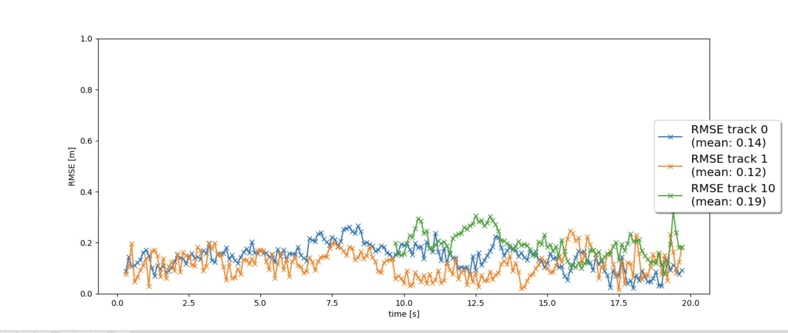

# Writeup: Track 3D-Objects Over Time

Please use this starter template to answer the following questions:

### 1. Four tracking steps and what you implemented there (filter, track management, association, camera fusion).
The first step was implementing the Kalman Filter (filter.py), which was a algorithm that tracked vehicles. Here we have the result of the Kalman Filter tracking one vehicle. This implementation was pretty straight forward.

The second step was implementing the tracking management code. The track management allowed it to initialize and delete tracks, determine and change the state of tracks, and change the score of the tracks. Here we can see that it was able to track track 0 through out the whole duration.

The third step was the association part. This allowed it to find the nearest neighbor data association to associate measurements to tracks, which also lets it track multiple objects at once. Here we needed to implement the association matrix between the measurements and the tracks and the Mahalanobis distance inorder to find which measurements belongs to which track. Here we can see that it is tracking and labeling multiple tracks

The fourth step was implementing the camera fusion, which included the camera measurement model and addded the camera measurements to the Extended Kalman Filter for tracking.

### 2. Do you see any benefits in camera-lidar fusion compared to lidar-only tracking (in theory and in your concrete results)? 
In theory, there could be some benifits of camera-lidar fusion comapred to lidar-only because camera can allow for more precise vehicle tracking, as it can better detect vehicles. It can also help get rid of false positive and false negative vehicle detections as there can be some reflective obstructions or false readings. In this project there was only a small decrease in RMSE, which shows that there wasnt much improvement over lidar-only, but having a backup is still good.

### 3. Which challenges will a sensor fusion system face in real-life scenarios? Did you see any of these challenges in the project?
One possible challange could be the extra cost of computing. Not only does the car need to read multiple sensors at once, but its needs to calculate and fuse them together, which can slow down the decision time for the vehicle. Another can be weird and dramatic weather. For example if its storming out and the camera happens to not detect a car but the lidar does then this can cause some complications. Although there wasn't any of these challenges in this project.

### 4. Can you think of ways to improve your tracking results in the future?
More extreme data like crazy weather(raining), crazy lighing(very dark or very bright), and objects flying in and out of the fov, like a deer of a plastic bag. More sensors to incorporate, like if there was multiple cameras and lidars used in the front view.
